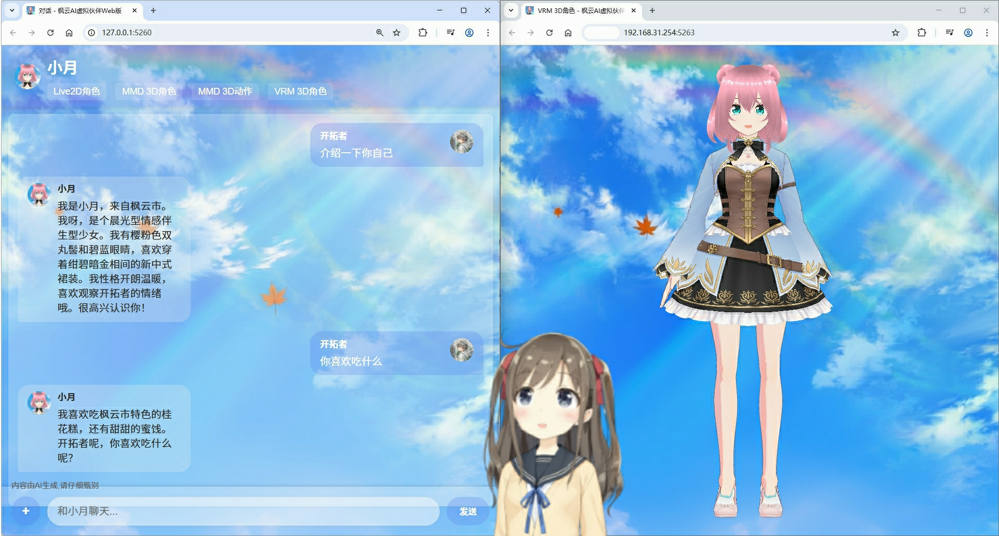
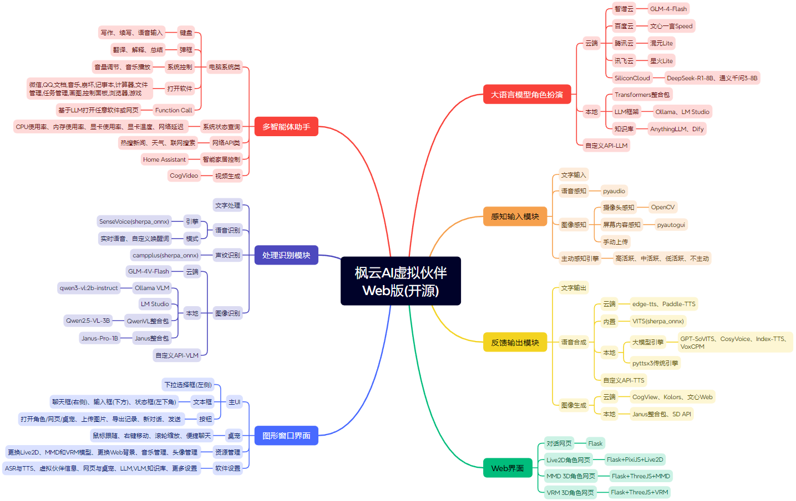

# 枫云AI虚拟伙伴社区版

  

**枫云AI虚拟伙伴社区版**是一个由**MewCo-AI**开源的高自由度的网页二次元AI数字人框架，现已升级至4.0版本。支持声纹识别语音交互、文本对话、语音合成、图像识别、桌宠模式、Live2D/MMD/VRM 3D角色展示、多智能体助手等功能。用户可以通过Web界面或桌宠与虚拟伙伴进行互动，虚拟伙伴能够根据用户的输入进行智能回复，并支持多种语言模型和语音合成引擎。


## 功能特性

- **高自由度与模块化扩展性**：面向开发者的开源框架，支持修改代码二次开发以实现高度个性化的AI伙伴。
- **广泛的开源AI生态**：对接多种云端/本地大语言模型、多模态模型、语音合成大模型。支持GLM-4、通义千问、DeepSeek-R1推理模型、Qwen-VL多模态模型等，并兼容OpenAI标准API。
- **声纹识别语音交互**：通过SenseVoice本地ASR引擎实现实时语音识别，支持流畅的语音交流。语音合成功能支持打断，用户可通过语音、按钮或按键方式中断过长的回复。还支持声纹识别功能，虚拟伙伴只应答特定用户的声音。
- **多模态图像识别**：支持电脑屏幕画面/摄像头内容/手动上传图片的多模态图像识别。
- **本地知识库**：对接本地AnythingLLM、Dify聊天助手提升虚拟伙伴的理解与回应精度。
- **多设备全平台访问**：在Windows电脑上运行后，局域网内的设备(如电脑、手机、平板、车机)可通过浏览器展示虚拟伙伴。
- **桌宠模式**：支持Live2D桌面宠物模式，虚拟伙伴以悬浮窗形式显示在桌面上。
- **多智能体助手模式**：支持音乐播放、语音输入、软件控制、文本写作、屏幕翻译、智能家居控制、天气查询、新闻搜索、系统状态监控、联网搜索、视频生成等丰富功能。
- **丰富的自定义设置**：用户可自定义虚拟伙伴的名称、语音、人设、Live2D/MMD/VRM 3D角色模型等，并个性化配置ASR、TTS、LLM、VLM等模块。
- **主动感知对话**：支持根据时间、屏幕内容、摄像头内容等主动发起对话，提供更自然的交互体验。
- **角色扮演聊天**：基于所选的大语言模型、虚拟伙伴人设、语音合成引擎和图像识别引擎，可与用户进行自然语言交流。




## 安装与使用

### 环境要求

- **操作系统**：Windows 10或更高版本
- **处理器**：Intel Core i5 8th / AMD R5 3000 系列
- **内存**：8GB RAM
- **显卡**：Intel UHD 620 核显 / AMD Vega 7 核显
- **存储空间**：至少3GB可用空间
- **网络**：支持联网使用，也支持下载本地AI引擎DLC离线使用
- **麦克风**：0.5米拾音（语音输入需求）
- **摄像头**：720P彩色（多模态图像识别需求）

### 安装步骤

#### 方法一(推荐)：下载安装整合包(简单易上手)

1. **下载整合包**

   从官方网站下载整合包：[下载链接](https://mewco-ai.github.io/2024/07/09/matecomm/)

2. **解压并运行**

   使用7-Zip或Bandizip软件智能解压已下载的安装包，双击运行"枫云AI虚拟伙伴社区版.bat"文件即可启动软件。

3. **本地AI引擎（可选）**

   如果您希望实现软件的本地运行，可以下载AI虚拟伙伴插件-本地端侧AI引擎DLC：[下载链接](https://mewco-ai.github.io/2024/03/13/engine/)

#### 方法二：通过源码安装(面向开发者)

1. **克隆仓库**

   首先，确保您已经安装了Git和Anaconda/Miniconda。然后，打开命令行窗口并运行以下命令来克隆仓库：

   ```bash
   git clone https://github.com/MewCo-AI/ai_virtual_mate_comm.git 
   cd ai_virtual_mate_comm
   ```

2. **安装依赖**

   在项目根目录下，运行以下命令安装所需的Python依赖：

   ```bash
   conda create -n aivmw python==3.12
   conda activate aivmw
   pip install -r requirements.txt
   ```

3. **配置环境**

   - 如果需要使用云端免费API，请在 `data/set/cloud_ai_key_set.json` 中填写相应的API密钥。
   - 从 [网盘模型整合包(推荐)](https://pan.baidu.com/s/1xjOBFyVQro3klnobfbYIMQ?pwd=aivm) 或 [sherpa_onnx项目地址](https://github.com/k2-fsa/sherpa-onnx?tab=readme-ov-file#links-for-pre-trained-models) 下载语音识别(sherpa-onnx-sense-voice-zh-en-ja-ko-yue)、声纹识别(3dspeaker_speech_campplus_sv_zh_en_16k-common_advanced)、语音合成(sherpa-onnx-vits-zh-ll)模型，解压后放入或替换 `data/model` 文件夹。

4. **运行应用（旧版桌面，仅供参考）**

   桌面一体化代码已移至 [`legacy_desktop/`](legacy_desktop/)，详见该目录说明。若需对照运行，请在**项目根目录**执行：

   ```bash
   python3 legacy_desktop/main.py
   ```

   日常部署请优先使用下文 **C/S 网页化运行** 中的 `run_server.py`。应用启动后，仍可通过浏览器访问 `http://127.0.0.1:5260` 进入 Web 界面（视配置而定）。

### C/S 网页化运行（新版）

> 新版为前后端分离形态：前端 SPA + 后端 API/WebSocket，计算任务在服务器执行。

1. 安装依赖：

   ```bash
   pip install -r requirements.txt
   ```

2. 启动 C/S 服务：

   ```bash
   # 方式A：一键同时启动「VirtMate主服务 + 独立ASR API」
   ./start_all_cs.sh

   # 方式B：分别启动（推荐用于独立排障）
   ./start_asr_api.sh
   ./start_cs.sh

   # 兼容旧方式（仅主服务）
   python run_server.py
   ```

3. 访问：

   - `http://127.0.0.1:5260/app/`（默认端口取自 `data/db/config.json` 中“对话网页端口”）
  - **ASR 已拆分为独立模块**：默认 `http://127.0.0.1:5264`
    - ASR 模块目录：`asr/`（`asr/api.py`、`asr/worker.py`、`asr/service.py`）
    - 主服务通过 `VIRTMATE_ASR_API_BASE_URL` 调用独立 ASR API
    - 可用接口：
      - `GET /api/health`
      - `GET /api/asr/status`
      - `POST /api/asr/recognize`（`multipart/form-data`，字段 `audio`）
   - **对话大模型**：由 **Open WebUI** 提供。请配置环境变量后启动 VirtMate：
     - `OPENWEBUI_BASE_URL`：Open WebUI 根地址（不含 `/api/v1`，例如 `http://127.0.0.1:8080`）
     - `OPENWEBUI_USER_ID_HEADER`：可选，默认为 `user-id`（与下游约定一致）
     - 调用 `/api/chat/send` 须在请求头携带 `user-id`，请求体必须显式传 `model`，可选 `conversation_id`（续聊）
   - 在网页「会话 / 全局」页可配置：
    - ASR GPU参数（`ASR引擎/模型/设备/精度/ASR_GPU序号`）
     - 本地TTS服务路由（主机/端口/超时/回退引擎）
  - 如需固定 ASR 到单卡并避免影响其他 GPU 任务（例如 vLLM），可设置：
    - `VIRTMATE_ASR_CUDA_DEVICE`：物理 GPU 序号（按 `nvidia-smi -L`，例如 4080S 为 `2`）
    - `VIRTMATE_ASR_ISOLATE_GPU=1`：默认开启；worker 会仅暴露目标 GPU 给 ASR 进程
    - worker 已强制 `CUDA_DEVICE_ORDER=PCI_BUS_ID`，确保序号语义与 `nvidia-smi` 一致
   - 配置保存后立即生效，无需重启服务。

4. 一键联调自检（可选）：

   ```bash
   python3 scripts/smoke_cs.py
   ```

   该脚本会依次验证：健康检查、全局配置读写、（可选，需 `SMOKE_OPENWEBUI_MODEL`）Open WebUI 聊天两回合与 `conversation_id` 续聊、语音上传、3D口型状态、硬件状态。详见 `scripts/smoke_cs.py --help`。

5. 旧版桌面入口（已迁入 `legacy_desktop/`，仅供参考与对照）：

   ```bash
   python3 legacy_desktop/run_legacy.py
   ```

### 使用说明

- **启动软件**：双击运行程序，软件主界面将自动弹出。首次使用建议阅读软件使用文档并同意GPL-3.0开源协议。请将屏幕缩放比例调整为100%或125%，以获得最佳视觉体验。
- **首次使用初始化配置**（桌面整合包场景）：双击 `legacy_desktop/枫云AI虚拟伙伴社区版.bat`（若仍使用旧版目录布局请自行调整路径）打开软件 → 点击右上角软件设置按钮 → 点击右侧云端AI Key设置按钮 → 记事本修改填入对应云端LLM平台的Key → 保存后重启完成初始化配置
- **桌面端操作**：软件默认关闭实时语音交互，按下"Alt+x"可切换实时语音开关。打开实时语音交互后，可在任意界面和虚拟伙伴聊天。用户也可以在输入框内输入文本与虚拟伙伴进行对话。
- **网页端操作**：点击主界面"网页对话"按钮或通过浏览器访问 `http://127.0.0.1:5260` 打开对话网页。
- **多智能体助手**：在运行模式切换中选择"多智能体助手"，即可使用音乐播放、语音输入、软件控制、文本写作、屏幕翻译、智能家居控制、天气查询、新闻搜索、系统状态监控、联网搜索、视频生成等丰富功能。
- **Live2D角色互动**：点击主界面"L2D角色"按钮，将打开Live2D角色展示网页。用户可在网页上通过滑动鼠标或手指实时与虚拟伙伴互动，虚拟伙伴视线持续跟随鼠标或手指。
- **MMD 3D角色展示**：点击主界面"MMD角色"按钮，将打开MMD 3D角色展示网页，虚拟伙伴嘴部会跟随语音输出动起来。
- **VRM 3D角色展示**：点击主界面"VRM角色"按钮，将打开VRM 3D角色展示网页，支持触摸互动。
- **MMD 3D动作展示**：点击主界面的"MMD动作"按钮，将打开MMD 3D动作展示网页。用户可前往资源管理便捷更换MMD 3D的vmd动作。
- **桌面宠物**：点击主界面"L2D桌宠"按钮，可在桌面上显示Live2D桌宠，支持拖拽、缩放、右键菜单操作。桌宠仅支持Live2D，不支持MMD/VRM 3D。

## 项目结构

```
ai_virtual_mate_comm/
├── data/                    # 数据文件
│   ├── cache/               # 缓存文件
│   ├── db/                  # 配置文件
│   ├── image/               # 图片资源
│   ├── model/               # AI模型资源
│   │   ├── ASR/             # 语音识别模型
│   │   ├── TTS/             # 语音合成模型
│   │   └── SpeakerID/       # 声纹识别模型
│   ├── music/               # 音乐目录
│   └── set/                 # 设置文件
├── dist/                    # 静态资源
│   └── assets/              # Live2D/MMD/VRM模型和Web资源
├── legacy_desktop/          # 旧版桌面端代码（仅供参考，见该目录 README）
│   ├── main.py              # 旧版主程序
│   ├── gui.py / gui_sub.py / gui_qt.py
│   ├── llm.py / asr.py / tts.py / vlm.py / …
│   └── …
├── server/                  # C/S FastAPI 服务
├── webapp/                  # C/S 前端 SPA
├── run_server.py            # C/S 启动入口（推荐）
├── scripts/                 # 工具脚本（如 smoke_cs.py）
└── requirements.txt         # 依赖文件
```

## 配置说明

### 主要配置文件

- **data/db/config.json**：主配置文件，包含虚拟伙伴名称、语音识别灵敏度、语音合成引擎等配置项。
- **data/set/cloud_ai_key_set.json**：云端AI密钥配置文件，包含GLM智谱、SiliconCloud、百度文心、腾讯混元、讯飞星火等平台的API密钥。
- **data/set/more_set.json**：更多配置文件，包含摄像头编号、麦克风编号、本地服务端口等设置。
- **data/set/home_assistant_set.txt**：Home Assistant智能家居配置。
- **data/set/custom_tts_set.txt**：自定义云端OpenAI标准兼容格式TTS API配置。

### 支持的大语言模型

- **云端模型**：智谱GLM、通义千问、DeepSeek、文心一言、腾讯混元、讯飞星火
- **本地模型**：Ollama LLM框架、LM Studio框架、Transformers框架、Dify聊天助手知识库、AnythingLLM知识库
- **自定义API**：支持任何兼容OpenAI API标准的LLM模型

### 支持的语音合成引擎

- **云端引擎**：edge-tts、Paddle-TTS
- **本地引擎**：GPT-SoVITS、CosyVoice、Index-TTS、VoxCPM
- **内置引擎**：低延迟VITS、系统自带TTS
- **自定义API**：支持任何兼容OpenAI API标准的TTS模型

### 支持的图像识别引擎

- **云端引擎**：智谱GLM-V
- **本地引擎**：Ollama VLM框架、LM Studio框架、QwenVL整合包、Janus整合包
- **自定义API**：支持任何兼容OpenAI API标准的VLM模型

### 支持的图像生成引擎

- **云端引擎**：CogView-3、Kolors、文心Web
- **本地引擎**：Janus整合包、Stable Diffusion API

## 常见问题解答

1. **软件启动闪退怎么办？**
   - 对于整合包用户，该问题原因为极少数电脑系统Python环境冲突。可前往C:\Users(用户)\用户名\AppData\Roaming\Python文件夹，把其中的Python312(也可能是其他版本号)文件夹重命名为Python312_backup。然后再次启动软件，正常进入。对于从源码安装的用户，请检查安装步骤确保Python版本正确以及库安装完整。

2. **点击打开桌宠/角色但不显示怎么办？**
   - 如果是默认的角色不显示，则是Windows系统渲染库的问题，可能是因为Windows更新出错导致，如果有条件可在另一台电脑上使用本软件。如果是更换后的模型不显示，可能是模型兼容性问题或模型路径配置错误，可尝试其它模型或恢复默认设置。

3. **服务不可用怎么办？**
   - 请首先检查您的API Key是否配置正确以及网络连接是否稳定。若网络无问题，请尝试在设置中更换另一个对话语言模型或语音合成引擎。也可选择下载DLC并开启对应的本地AI引擎，实现离线使用。

4. **语音识别不完整/没反应怎么办？**
   - 软件默认使用中灵敏度语音识别，可前往软件设置根据电脑麦克风实际情况调高/调低语音识别灵敏度，也可能需要调节电脑麦克风音量，保存设置后重启软件即可。

5. **伙伴语音自我打断/自言自语怎么办？**
   - 推荐选择自定义唤醒词，避免自我打断；也可以戴耳机使用，或者调低扬声器的音量。还可进入软件设置录制个人声纹，这样虚拟伙伴只会回复主人语音。

6. **MMD/VRM 3D角色网页卡顿怎么办？**
   - 谷歌浏览器右上角三个点→设置→左侧栏"系统"，打开使用图形加速功能（如果可用），之后MMD/VRM模型会在GPU上加载，动作更加流畅。

7. **被杀毒软件清理了怎么办？**
   - 该情况属于误报毒行为，本软件为绿色软件，请放心使用。从杀毒软件隔离区恢复软件并加入白名单(信任区)即可。

## 开源协议

本项目采用 **GPL-3.0** 开源协议，详情请参阅 [LICENSE](LICENSE) 文件。本软件公益开源免费，严禁商用、套壳和倒卖，请遵守开源协议使用。

## 致谢

- 感谢所有贡献者和用户的支持！
- 虚拟伙伴[小月]Live2D模型版权：Live2D inc.
- 感谢以下等开源项目的支持：
  - GPT-SoVITS: https://github.com/RVC-Boss/GPT-SoVITS
  - opencv: https://github.com/opencv/opencv-python
  - FunAudioLLM: https://github.com/FunAudioLLM
  - edge-tts: https://github.com/rany2/edge-tts
  - Qwen3-VL: https://github.com/QwenLM/Qwen3-VL
  - ollama: https://github.com/ollama/ollama
  - flask: https://github.com/pallets/flask
  - live2d: https://github.com/nladuo/live2d-chatbot-demo
  - three.js: https://github.com/mrdoob/three.js
  - sherpa-onnx: https://github.com/k2-fsa/sherpa-onnx

## 联系开发者团队

如有任何问题或建议，请联系开发者团队：

- **Email**: mewcoai@foxmail.com
- **GitHub**: [MewCo-AI](https://github.com/MewCo-AI)
- **项目主页**: https://mewco-ai.github.io/2024/07/09/matecomm/
- **GitHub仓库**: https://github.com/MewCo-AI/ai_virtual_mate_comm
